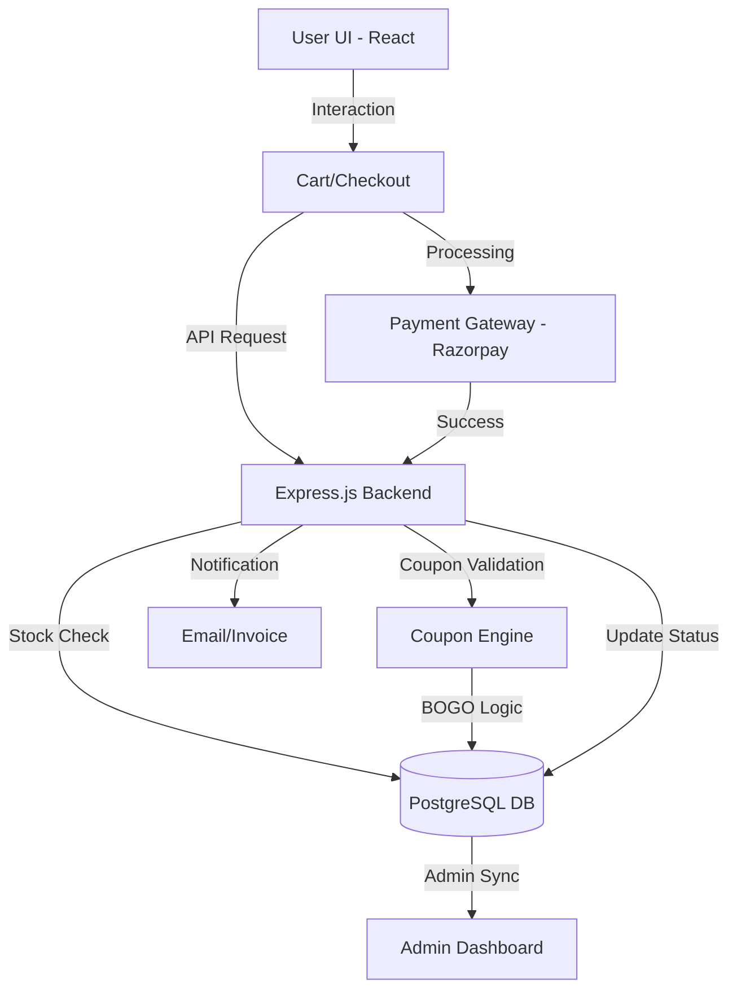

<<<<<<< HEAD
# House of Urvaah - Backend API Service

> **RESTful API Backend for House of Urvaah Luxury Apparel Platform**  
> Built with Node.js, Express.js, PostgreSQL (Supabase), and Razorpay.
=======
# House of Urvaah - Backend (house-of-urvaah-api)

## Project Overview
This is the backend API service for **House of Urvaah**, a comprehensive full-stack e-commerce solution specializing in **female clothing and fashion**. Built with **Node.js** and **Express.js**, it provides a secure and scalable API for e-commerce transactions and data management.

## Technical Stack
- **Runtime:** Node.js
- **Framework:** Express.js
- **Database:** PostgreSQL (hosted on Supabase)
- **Authentication:** Passport.js (Google & Facebook OAuth), JWT, bcryptjs
- **Payments:** Razorpay Integration
- **File Management:** Multer (local/cloud uploads)
- **Document Generation:** Puppeteer-core, Handlebars (for invoices/reports)
- **Analytics:** Google Analytics 4 integration

## System Architecture Flow


## Key Backend Features
- **Security:** CSRF and JWT-based authentication with Passport.js integration.
- **RESTful API:** Structured endpoints for products, orders, coupons, and users.
- **Payment Processing:** Integrated with Razorpay for secure online transactions.
- **Stock Validation:** Real-time stock counts and automatic locking during checkout.
- **Coupon Engine:** Sophisticated logic for Fixed/Percentage and Buy One Get One (BOGO) discounts.
- **Document Generation:** Automated generation of PDF invoices and reports via Puppeteer.

## Setup Instructions
1. **Navigate to the directory:**
   ```bash
   cd house-of-urvaah-api
   ```
2. **Install dependencies:**
   ```bash
   npm install
   ```
3. **Configure Environment:**
   - Create a `.env` file based on `.env.example`.
   - Provide PostgreSQL connection credentials, OAuth keys, and Razorpay API details.
4. **Start Server:**
   - Development Mode: `npm run dev`
   - Production Mode: `npm start`

## Project Team
**Owner:** Vinod Mahajan Sir  
**Manager:** Sagar Mali Sir  
**Developers:**  
1. Aniket Mali  
2. Yogesh Chitrakathi  
3. Kuldeep Mahajan  

**Continuous Maintenance:** Yogesh Chitrakathi
>>>>>>> 90c3b73be65e51c1ba1d3814ac8bd03e14cbefd1

---

## 🌟 Overview
This service provides the core backend RESTful APIs for the **House of Urvaah** female clothing and fashion e-commerce platform. It handles customer authentication, catalog querying, cart management, checkout, Razorpay payments, automated PDF invoicing, and an intelligent NLP chatbot.

For full full-stack system architecture, refer to the [Root Project Documentation](../PROJECT_DOCUMENTATION.md).

---

## 🛠️ Technical Stack
- **Runtime:** Node.js (Node 18+)
- **Framework:** [Express.js](https://expressjs.com/) (`^4.18.2`)
- **Database:** PostgreSQL (hosted on Supabase) via `pg` connection pool
- **Cloud Storage:** Supabase Storage (`@supabase/supabase-js`)
- **Authentication:** JWT, bcryptjs, Passport.js (Google & Facebook OAuth)
- **Payment Processing:** [Razorpay](https://razorpay.com/) SDK (`^2.9.6`)
- **Document & PDF Generation:** Puppeteer-core, Handlebars, `@sparticuz/chromium`
- **NLP & Search Engine:** `natural` (`^8.1.0`)
- **File Management:** Multer (`^2.0.2`)

---

## 📁 Directory Structure
```text
src/
├── server.js              # Process entry point & port listener (Port 4000)
├── app.js                 # Express application & route wiring
├── config/                # Database pool, Passport OAuth, and Supabase client
├── controllers/           # Business logic for auth, orders, products, refunds
├── middlewares/           # JWT protection, role authorization, and Multer
├── routes/                # 24 modular route definitions
├── services/              # Product formatting, Supabase storage, NLP chatbot, PDF invoicing
├── templates/             # Handlebars email & PDF invoice templates
└── utils/                 # Token generation and validation helpers
```

---

## 🔑 Key API Modules

| Route Prefix | Description |
| :--- | :--- |
| `/api/products` | Garment catalog querying, multi-filters, and admin management |
| `/api/categories` | Garment collections and subcategories |
| `/api/auth` | JWT registration, login, profile, and OAuth redirects |
| `/api/cart` | Persistent shopping bag items |
| `/api/orders` | Order creation, history, and automated PDF invoice downloads |
| `/api/payments` | Razorpay order generation and cryptographic signature verification |
| `/api/admin/refunds` | Instant automated Razorpay refund desk |
| `/api/coupons` | Promo code validation and discount calculations |
| `/api/chatbot` | 11-stage NLP search and styling assistant |
| `/api/admin/analytics` | Sales performance, traffic, and revenue metrics |

---

## ⚙️ Environment Configuration
Configure `.env` in the root of `house-of-urvaah-api`:

```env
PORT=4000
NODE_ENV=development
CLIENT_URL=http://localhost:5173

# Database
PGHOST=your_supabase_postgres_host
PGUSER=postgres
PGPASSWORD=your_postgres_password
PGDATABASE=postgres
PGPORT=5432

# Supabase Storage & CDN
SUPABASE_URL=https://fhbdceauisvlcpmuzpmf.supabase.co
SUPABASE_SERVICE_ROLE_KEY=your_service_role_key
SUPABASE_STORAGE_BUCKET=houseofurvaah-media

# Authentication & Session Secrets
JWT_SECRET=your_jwt_secret
SESSION_SECRET=your_session_secret

# Razorpay Payment Gateway
RAZORPAY_KEY_ID=your_razorpay_key_id
RAZORPAY_KEY_SECRET=your_razorpay_key_secret

# OAuth (Optional)
GOOGLE_CLIENT_ID=your_google_client_id
GOOGLE_CLIENT_SECRET=your_google_client_secret
FACEBOOK_APP_ID=your_facebook_app_id
FACEBOOK_APP_SECRET=your_facebook_app_secret
```

---

## 🚀 Getting Started

```powershell
# 1. Install dependencies
npm install

# 2. Run in development mode (with nodemon)
npm run dev

# 3. Run in production mode
npm start
```

* API will run at: `http://localhost:4000`
* Test endpoint: `http://localhost:4000/` (returns `"HomeVed API is running...."`)
